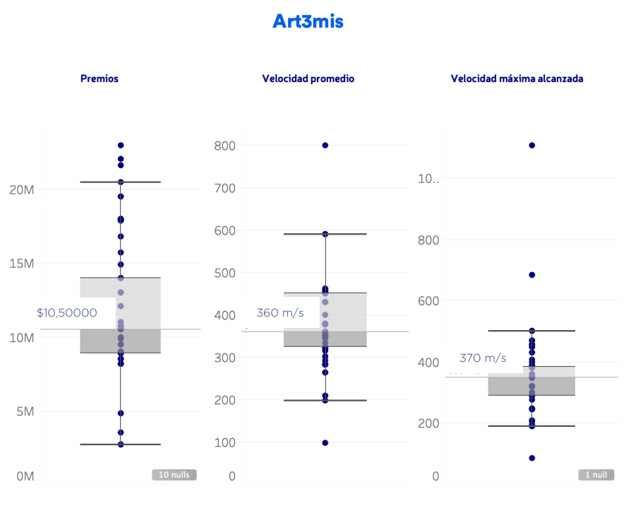
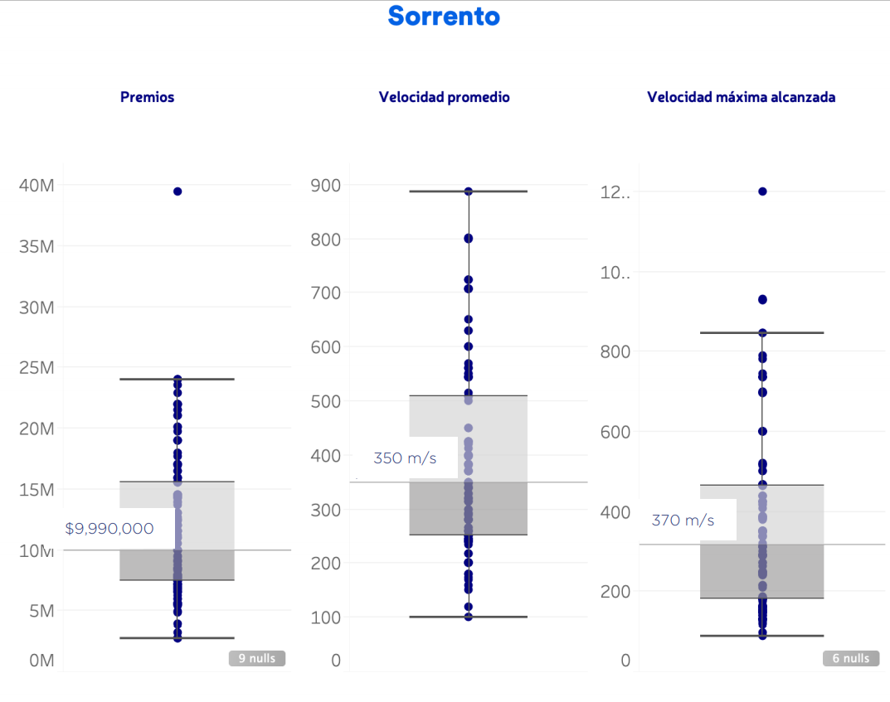
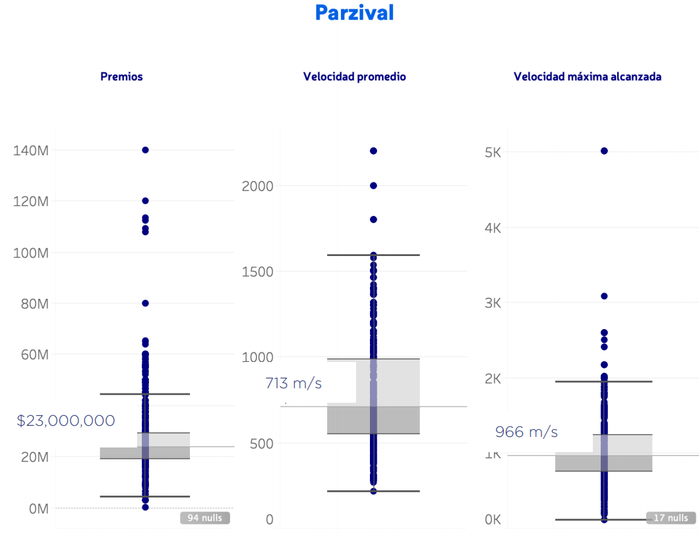
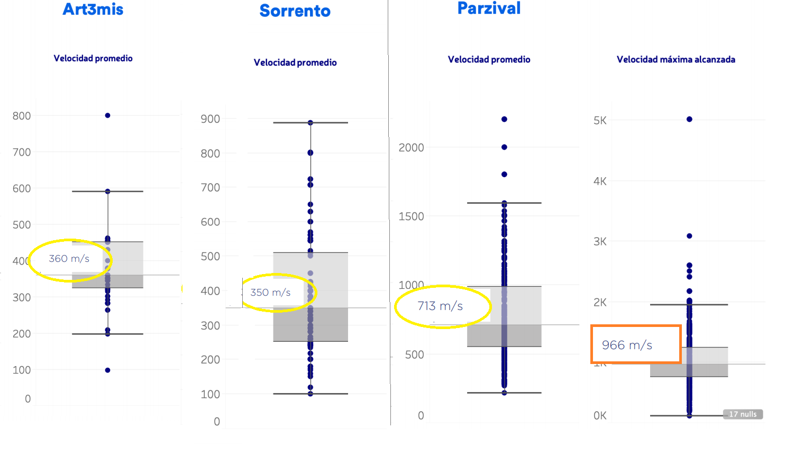
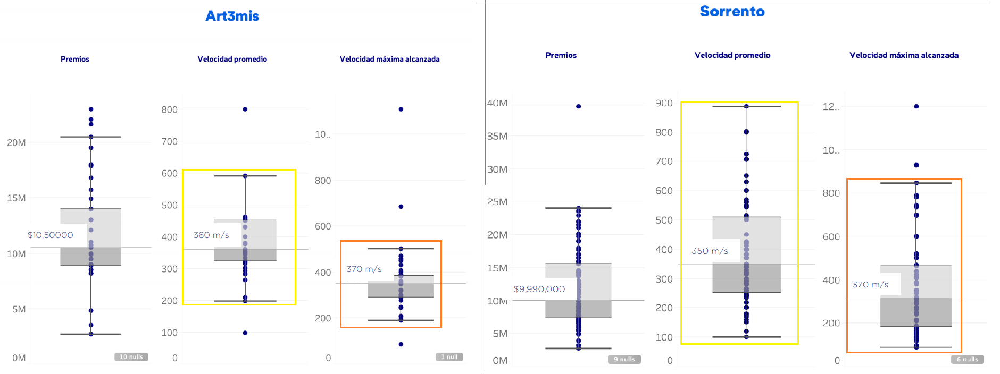

<h1> Desafío Car Race </h1> 

El equipo High Five debe participar en 2 distintas carreras en la misma fecha. Tenemos que decidir 
a quién enviamos a cada carrera. Cada carrera ofrece diversos premios que varían en monto y 
oportunidad de obtenerlo. Más aún, no todas las carreras son iguales: en algunas de ellas hay 
rectas largas en las que se pueden alcanzar velocidades altísimas, mientras que en otras abundan 
las curvas.
Las dos carreras son las siguientes:
    

¡El equipo High Five debe participar en 2 distintas carreras en la misma fecha. Tenemos que decidir a quién enviamos a cada carrera. Cada carrera ofrece diversos premios que varían en monto y oportunidad de obtenerlo. Más aún, no todas las carreras son iguales: en algunas de ellas hay rectas largas en las que se pueden alcanzar velocidades altísimas, mientras que en otras abundan las curvas.

    
Las dos carreras son las siguientes:
    
+ Pacman Race:
    + Pocos premios disponibles, pero de montos altos
    + Llena de rectas prolongadas y pocas curvas.
+ Silent Hill Race:
    + Bastantes premios, pero de montos pequeños.
    + Demasiadas curvas, callejones sin salidas y sustos que puedes prever si tienes el tiempo de hacerlo.
    

Dispones de tres potenciales corredores (Art3mis, Sorrento y Parzival) y sus respectivas estadísticas ( ver gráficas de abajo). ¿Podrías elegir a los dos candidatos y justificar tu elección?

    

    

# Pacman Race:
+ Llena de rectas prolongadas y pocas curvas.

Key words: **Long lines** and **few curves**

This means that you can drive **very Fast** in the long lines. 

We need a fast driver for this race. 

Best choice: **PARZIVAL**

Analysis:

For this race is going to be able to drive at high speeds. The fastest driver is **Parzival** because of his high mean speed and high average top speed. Driving this fast is an advantage for this type of races with long lines.

# Silent Hill Race:
+ Demasiadas curvas, callejones sin salidas y sustos que puedes prever si tienes el tiempo de hacerlo.
    
Key words: 
+ **Many Curves**
+ **Dead ends** 
+ **Scares**
+ **You can anticipate if you have the time**

For this race you need a driver who can take the curves and anticipate to the dead ends, scares and curves.

We need a cautios driver, not a fast one.

Best choice: **Art3mis**

Analysis:

For this race we need a cautios driver who drives fast enough to prevent the obstacles. **Art3mis** use to drive more carefully than **Sorrento** because of the smaller mean speed box in yellow and the smaller top speed box in orange.

If this race were with less obstacles and curves, **Sorrento** would be a better fit for the race because he could take advantage of his faster driving in lines.