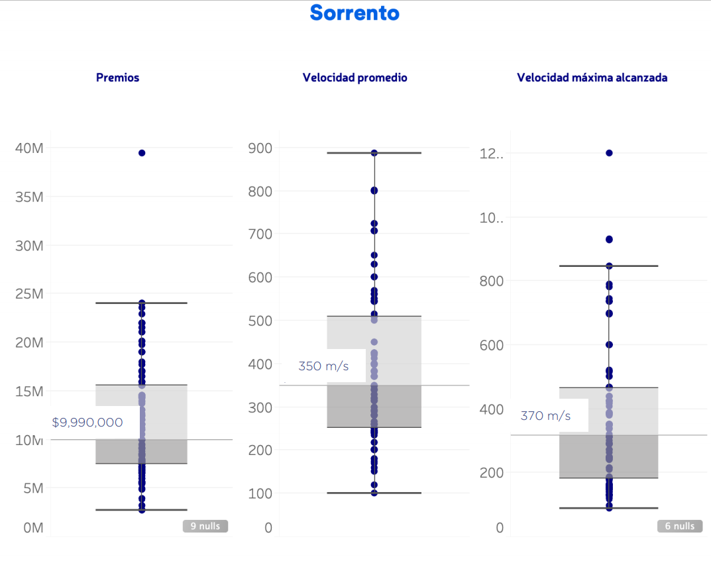

<h1> Desafío Car Race </h1> 

El equipo High Five debe participar en 2 distintas carreras en la misma fecha. Tenemos que decidir 
a quién enviamos a cada carrera. Cada carrera ofrece diversos premios que varían en monto y 
oportunidad de obtenerlo. Más aún, no todas las carreras son iguales: en algunas de ellas hay 
rectas largas en las que se pueden alcanzar velocidades altísimas, mientras que en otras abundan 
las curvas.
Las dos carreras son las siguientes:
    

¡El equipo High Five debe participar en 2 distintas carreras en la misma fecha. Tenemos que decidir a quién enviamos a cada carrera. Cada carrera ofrece diversos premios que varían en monto y oportunidad de obtenerlo. Más aún, no todas las carreras son iguales: en algunas de ellas hay rectas largas en las que se pueden alcanzar velocidades altísimas, mientras que en otras abundan las curvas.

    
Las dos carreras son las siguientes:
    
+ Pacman Race:
    + Pocos premios disponibles, pero de montos altos
    + Llena de rectas prolongadas y pocas curvas.
+ Silent Hill Race:
    + Bastantes premios, pero de montos pequeños.
    + Demasiadas curvas, callejones sin salidas y sustos que puedes prever si tienes el tiempo de hacerlo.
    

Dispones de tres potenciales corredores (Art3mis, Sorrento y Parzival) y sus respectivas estadísticas ( ver gráficas de abajo). ¿Podrías elegir a los dos candidatos y justificar tu elección?

    

    

# Pacman Race:
+ Llena de rectas prolongadas y pocas curvas.

Key words: **Long lines** and **few curves**

This means that you can drive **very Fast** in the long lines. 

We need a fast driver for this race, 

Best choice: **PARZIVAL**

+ Silent Hill Race:
    + Demasiadas curvas, callejones sin salidas y sustos que puedes prever si tienes el tiempo de hacerlo.